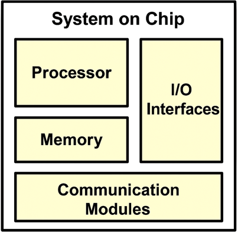
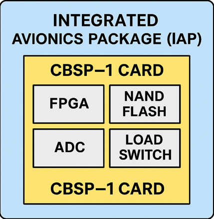
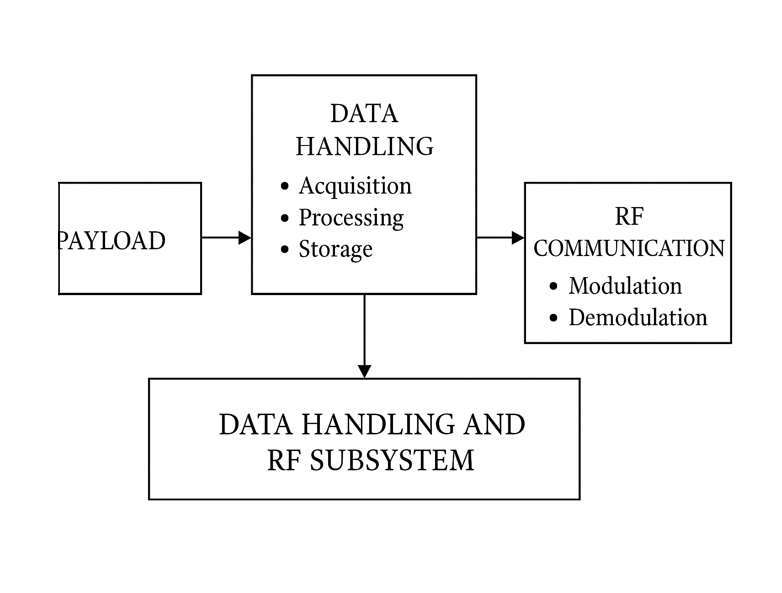
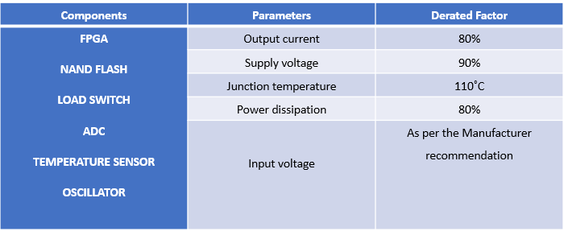

# ISRO SoC Reliability Project

## 🔷 Project Overview
This project focuses on the design and reliability analysis of System-on-Chip (SoC) for space applications at ISRO URSC. It emphasizes data handling systems, derating techniques, and radiation tolerance.

---

## 🔷 Objectives
- Analyze reliability of electronic components
- Study derating techniques for space systems
- Understand data handling subsystem in satellites
- Ensure fault-tolerant design for harsh environments

---

## 🔷 Key Concepts
- System-on-Chip (SoC)
- Radiation Effects (TID, SEE)
- Derating Analysis
- Fault Tolerance Techniques
- Data Handling Systems

---

## 🔷 Methodology
- Component stress analysis
- Reliability prediction
- Worst Case Circuit Analysis (WCCA)
- Failure Mode and Effects Analysis (FMEA)

---

## 🔷 Results
The study ensures improved reliability of SoC-based systems by operating components within safe limits and applying radiation mitigation techniques.

---

## 🔷 Applications
- Satellite avionics
- Space communication systems
- Data handling subsystems
- Deep space missions

---

## 🔷 Skills Demonstrated
- Reliability Engineering
- SoC Design Concepts
- Space Electronics
- Data Analysis
- Engineering Simulation

## 🔷 Key System Diagrams

  
  

  <b>System-on-Chip Architecture</b> &nbsp;&nbsp;&nbsp;&nbsp;&nbsp;&nbsp;&nbsp;&nbsp;&nbsp;&nbsp;&nbsp;&nbsp;&nbsp;&nbsp;&nbsp;&nbsp;&nbsp;&nbsp;&nbsp;&nbsp;
  <b>Integrated Avionics Platform (IAP)</b>

---

  
  

  <b>Logic Design</b> &nbsp;&nbsp;&nbsp;&nbsp;&nbsp;&nbsp;&nbsp;&nbsp;&nbsp;&nbsp;&nbsp;&nbsp;&nbsp;&nbsp;&nbsp;&nbsp;&nbsp;&nbsp;&nbsp;&nbsp;&nbsp;&nbsp;&nbsp;&nbsp;
  <b>Derating Analysis</b>

